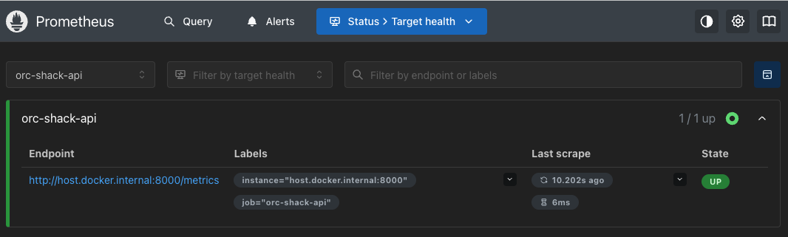
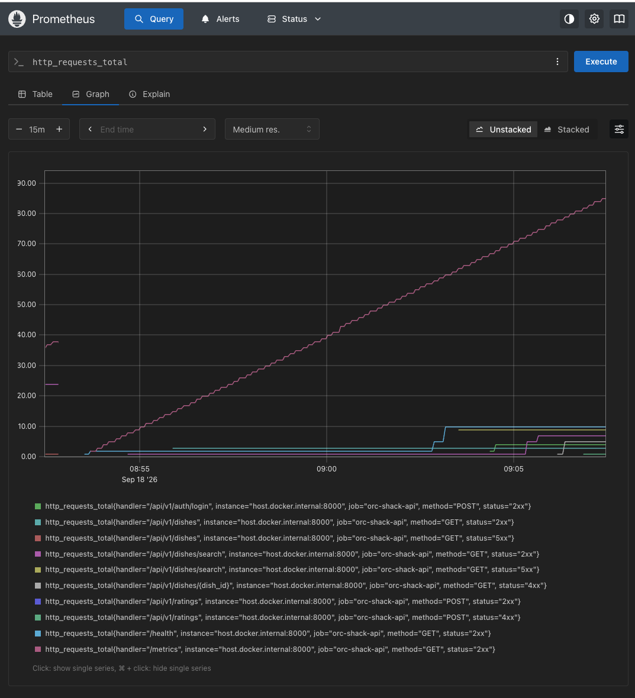

# The Orc Shack REST API

## Table of Contents

- [Overview](#overview)
- [AI methodology notes](#ai-methodology-notes)
- [Technology Stack](#technology-stack)
- [Getting Started](#getting-started)
  - [Prerequisites](#prerequisites)
  - [Quick Start](#quick-start)
  - [Environment Configuration](#environment-configuration)
  - [Database](#database)
  - [Manual Setup](#manual-setup)
  - [Development Commands](#development-commands)
  - [Application URLs](#application-urls)
- [Troubleshooting](#troubleshooting)
  - [PostgreSQL Container Fails to Start](#postgresql-container-fails-to-start)
- [Architecture & Design Decisions](#architecture--design-decisions)
  - [Application Structure](#application-structure)
  - [Request Flow](#request-flow)
  - [Service and Repository Layers](#service-and-repository-layers)
  - [Configuration](#configuration)
  - [Database and Migrations](#database-and-migrations)
  - [Error Handling](#error-handling)
  - [Authentication and Authorization](#authentication-and-authorization)
  - [Testing](#testing)
  - [Scope and Trade-offs](#scope-and-trade-offs)
- [API Documentation & Interactive Exploration](#api-documentation--interactive-exploration)
  - [Swagger UI](#swagger-ui)
  - [Authentication Flow](#authentication-flow)
  - [ReDoc](#redoc)
- [Testing & Quality Assurance](#testing--quality-assurance)
  - [Running the Tests](#running-the-tests)
  - [Code Quality](#code-quality)
- [Observability](#observability)
  - [Prometheus Metrics and Viewing Metrics in Prometheus](#prometheus-metrics-and-viewing-metrics-in-prometheus)
  - [Viewing Metrics in Prometheus](#viewing-metrics-in-prometheus)
  - [Prometheus Monitoring](#prometheus-monitoring)


## Overview

The Orc Shack REST API is a RESTful backend for a Middle-earth restaurant.

The API allows authenticated users to interact with the restaurant's dishes and ratings. It provides user registration and login, role-based authorization, dish management, dish search, customer ratings, input validation, brute-force protection, centralized error handling, application logging, automated testing, and Prometheus metrics.

The application was developed as part of the Bash Software Engineer take-home assignment, with a focus on **maintainability, testability, security, observability, and reasonable production readiness**.

## AI methodology notes

A short record of how ChatGPT and GitHub Copilot were used during the project, including the approach to architecture decisions, trade-offs, and ownership, is available in [ai/README.md](ai/README.md).

## Technology Stack

- **Python 3.11+**
- **FastAPI** — REST API framework
- **PostgreSQL** — relational database
- **SQLAlchemy** — ORM and database access
- **Pydantic** — request and response validation
- **Pydantic Settings** — application configuration
- **Alembic** — database migrations
- **Argon2** — password hashing
- **PyJWT** — JWT authentication
- **Pytest** — automated testing
- **Ruff** — linting and formatting
- **Prometheus** — application metrics
- **Docker / Docker Compose** — local infrastructure


## Getting Started

### Prerequisites

The following tools are required to run the application locally:

- Python 3.11+
- Docker
- Docker Compose
- Make

Docker Compose is used to run the PostgreSQL database and Prometheus locally.

#### Docker Compose prerequisites

To run the complete stack with:

```bash
docker compose up --build
```

you need:

- Docker Desktop installed and running, including Docker Compose v2.
- Internet access to download the base images and Python dependencies during the build.
- Ports `8000`, `5432`, and `9090` available on the host.
- Sufficient Docker resources to run the API, PostgreSQL, and Prometheus containers.

Python, Make, and a local virtual environment are not required for the Docker-based setup.
The Compose configuration supplies development defaults when `.env` is absent, but you should
copy `.env.example` to `.env` and set a secure `JWT_SECRET_KEY` before sharing or deploying the stack.

### Quick Start

Clone the repository and navigate to the project directory:

```bash
git clone <repository-url>
cd <repository-directory>
```

#### Docker setup (recommended)

To run the API, PostgreSQL, and Prometheus entirely in Docker:

```bash
docker compose up --build
```

The Docker entrypoint runs the latest Alembic migrations and creates the default
admin user if one does not already exist before starting FastAPI. Docker installs
the Python dependencies inside the API image, so no local virtual environment is
required.

The Docker startup process will:

1. Build the API image and install the Python dependencies inside the image.
2. Start PostgreSQL and wait for it to become healthy.
3. Run the latest Alembic database migrations.
4. **Create the default admin user if one does not already exist.**
5. Start the FastAPI application on port `8000`.
6. Start Prometheus on port `9090`.

Unlike the local setup, Docker does not create a local virtual environment or copy
`.env.example` to `.env`. Compose uses the values from `.env` when available and
development defaults from `docker-compose.yml` when they are not.

Once started, the API will be available at:

`http://localhost:8000`

Interactive API documentation is available through Swagger UI:

`http://localhost:8000/docs`

#### Local setup

If Docker is unavailable, start the application directly with the local Python environment:

```bash
make run
```

The local startup process will:

1. Create the Python virtual environment if it does not already exist.
2. Install the required Python dependencies.
3. Create `.env` from `.env.example` if `.env` does not already exist.
4. Start PostgreSQL, run migrations, create the default admin user, and start FastAPI.

#### Default development admin credentials

These credentials are created by both the Docker and local startup flows:

- **Email:** `admin@admin.com`
- **Password:** `admin123`
- **Role:** `ADMIN`

### Environment Configuration

The application uses environment variables for configuration.

For local development, create a `.env` file from the provided example:

```bash
cp .env.example .env
```

The `.env` file contains environment-specific configuration and secrets and should not be committed to Git.

The `.env.example` file contains placeholder values and is committed to the repository.

The main configuration values include:

- `DATABASE_URL` — PostgreSQL connection URL
- `JWT_SECRET_KEY` — secret used to sign JWT access tokens
- `JWT_ALGORITHM` — JWT signing algorithm
- `JWT_ISSUER` — expected service that issued JWT access tokens
- `JWT_TOKEN_VERSION` — token claim version used to invalidate older token formats
- `JWT_ACCESS_TOKEN_EXPIRE_MINUTES` — access token lifetime
- `LOG_LEVEL` — application logging level
- `ENVIRONMENT` — application environment

### Database

PostgreSQL is provided through Docker Compose.

To start PostgreSQL independently:

```bash
docker compose up -d postgres
```

Database schema changes are managed using Alembic.

To apply the current migrations:

```bash
alembic upgrade head
```

The `make run` command performs this step automatically.

### Manual Setup

If `make run` is unavailable or does not work in a particular environment, the application can be started manually.

Create and activate a virtual environment:

```bash
python3 -m venv venv
source venv/bin/activate
```

Install the dependencies:

```bash
python -m pip install --upgrade pip
python -m pip install -r requirements.txt
```

Create the environment configuration:

```bash
cp .env.example .env
```

Start PostgreSQL:

```bash
docker compose up -d postgres
```

Run the database migrations:

```bash
alembic upgrade head
```

Create the **default admin user**:

```bash
python -m scripts.create_admin
```

Start the FastAPI application:

```bash
uvicorn app.main:app --host 0.0.0.0 --port 8000 --reload
```

### Development Commands

The following Make commands are available:

| Command | Description |
|---|---|
| `make venv` | Create the Python virtual environment if it does not already exist |
| `make install` | Install the required Python dependencies |
| `make run` | Start the application and required services |
| `make test` | Run the automated test suite |
| `make migrate` | Apply any pending Alembic database migrations |
| `make lint` | Run Ruff linting |
| `make format` | Format the code using Ruff |
| `make check` | Run Ruff linting and the automated test suite |
| `make metrics` | Open the FastAPI Prometheus metrics endpoint |
| `make prometheus` | Start Prometheus and open its web interface |
| `make db-up` | Start the PostgreSQL Docker service |
| `make db-down` | Stop the PostgreSQL Docker service |
| `make clean` | Remove the test database container and Python virtual environment |

### Application URLs

Once the application is running:

| URL | Description |
|---|---|
| `http://localhost:8000/docs` | Swagger UI |
| `http://localhost:8000/redoc` | ReDoc |
| `http://localhost:8000/health` | Application health check |
| `http://localhost:8000/metrics` | Prometheus metrics |
| `http://localhost:9090` | Prometheus web interface |

## Troubleshooting

If `make metrics` is run before the FastAPI application is running, the command will exit with an error and instruct the developer to run `make run` first.

If PostgreSQL is unavailable, check the status of the Docker services:

```bash
docker compose ps
```

PostgreSQL can be started with:

```bash
docker compose up -d postgres
```

If the application cannot connect to PostgreSQL, verify that the `DATABASE_URL` in `.env` matches the PostgreSQL configuration in `docker-compose.yml`.

### PostgreSQL container fails to start

If `make run` fails during the Alembic migration step with a PostgreSQL connection error such as:

```text
sqlalchemy.exc.OperationalError: connection failed:
connection to server at "localhost", port 5432 failed:
Connection refused
```

check the PostgreSQL container:

```bash
docker compose ps
```

If the `postgres` container is restarting, inspect its logs:

```bash
docker logs postgres
```

The current Compose configuration pins PostgreSQL to version 17. If an existing
database volume was created with an incompatible PostgreSQL version, recreate the
local development volume:

```bash
docker compose down -v
```

Then start the application normally:

```bash
make run
```

`make run` will start PostgreSQL, apply the pending Alembic migrations, create the default admin user if one does not already exist, and start the FastAPI application. The API service remains part of the Compose configuration and should not be removed.

**Note:** `docker compose down -v` removes the PostgreSQL Docker volume and therefore deletes the local development database. Do not use this command if you need to preserve existing local data.


## Architecture & Design Decisions

### Application Structure

The application follows a layered structure that separates HTTP handling, business logic, database access, and infrastructure concerns.

```text
app/
├── api/
│   ├── dependencies.py
│   ├── exception_handlers.py
│   ├── health.py
│   ├── serializers/
│   │   └── dish.py
│   └── v1/
│       ├── auth.py
│       ├── dishes.py
│       ├── ratings.py
│       └── router.py
│
├── core/
│   ├── config.py
│   ├── exceptions.py
│   ├── logger.py
│   └── security.py
│
├── db/
│   └── database.py
│
├── models/
│   ├── dish.py
│   ├── rating.py
│   └── user.py
│
├── repositories/
│   ├── dish_repository.py
│   ├── rating_repository.py
│   └── user_repository.py
│
├── schemas/
│   ├── dish.py
│   ├── rating.py
│   └── user.py
│
└── services/
    ├── auth_service.py
    ├── dish_service.py
    └── rating_service.py
```

The main responsibilities are:

| Directory | Responsibility |
|---|---|
| `api/` | HTTP routes, request handling, dependencies, serializers, and exception handlers |
| `core/` | Cross-cutting concerns such as configuration, logging, security, and application exceptions |
| `db/` | SQLAlchemy engine, sessions, declarative base, and database connectivity |
| `models/` | SQLAlchemy ORM models representing database entities |
| `repositories/` | Database queries and persistence operations |
| `schemas/` | Pydantic models for request validation and API responses |
| `services/` | Business logic and application rules |
| `tests/` | Automated tests for the application's behaviour |

The separation allows each layer to have a focused responsibility. API routes handle HTTP concerns, serializers convert application results into response schemas, services handle business rules, repositories handle database operations, and SQLAlchemy handles communication with PostgreSQL.

This keeps the implementation easier to test and change without introducing additional abstraction layers that are not necessary for the scope of the assignment.


### Request Flow

Requests flow through the application from the API layer to the service layer, repository layer, and database.

Authentication and authorization are handled by FastAPI dependencies before the protected route handler executes.

For example, when an authenticated admin creates a new dish:

```text
HTTP Request
    ↓
API Route Dependency
    ↓
Authentication
    ↓
Authorization
    ↓
API Route Handler
    ↓
Service
    ↓
Repository
    ↓
SQLAlchemy
    ↓
PostgreSQL
    ↓
Repository
    ↓
Service
    ↓
API Response
```

The responsibilities at each stage are:

1. **API Route Dependency** — FastAPI resolves the dependencies required by the endpoint.
2. **Authentication** — The authentication dependency extracts the bearer token, validates the JWT, identifies the user, and retrieves the corresponding user from the database. If authentication fails, the request is rejected with `401 Unauthorized`.
3. **Authorization** — For endpoints that require specific permissions, an authorization dependency checks the authenticated user's role. For example, dish creation requires an admin user. If the user is authenticated but does not have the required role, the request is rejected with `403 Forbidden`.
4. **API Route Handler** — Once authentication and authorization succeed, the route handler receives the authenticated user and validated request data and calls the appropriate service.
5. **Service** — Applies the application's business rules and coordinates the operation.
6. **Repository** — Performs the required database operation using SQLAlchemy.
7. **PostgreSQL** — Stores or retrieves the data.
8. **Repository / Service** — Returns the database result to the service layer.
9. **API Route** — Converts the result into the appropriate Pydantic response schema and returns the HTTP response.

Public endpoints such as registration and login do not require an existing authentication token. Login instead authenticates the supplied credentials and returns a JWT access token that can be used for subsequent protected requests.

Errors are handled centrally rather than being converted into HTTP responses independently by each service. Application-specific exceptions are raised from the appropriate layer and handled by the centralized exception handlers in `api/exception_handlers.py`.

This separation keeps authentication, authorization, HTTP concerns, business logic, and database operations clearly separated while allowing the individual components to be tested independently.

### Service and Repository Layers

The application separates business logic from database access through service and repository layers.

The **service layer** handles application and business rules, including:

- Validating whether a dish or user exists
- Preventing duplicate ratings
- Determining whether an operation is allowed

The **repository layer** handles database operations using SQLAlchemy, including:

- Querying entities
- Creating entities
- Updating entities
- Deleting entities

The typical request flow is:

```text
API → Service → Repository → SQLAlchemy → PostgreSQL
```

This separation keeps API routes focused on HTTP concerns and allows business logic and database operations to be tested independently.

Repositories are organized by domain rather than using generic repository abstractions. This keeps the implementation straightforward while maintaining a clear separation of responsibilities appropriate for the scope of the application.


### Configuration

Application configuration is centralized in `app/core/config.py` using **Pydantic Settings**.

Configuration values such as the database URL, logging level, application environment, and JWT settings are loaded from environment variables, with non-sensitive defaults provided where appropriate.

A local `.env` file is supported for development and is excluded from version control. An `.env.example` file is committed with placeholder values to document the required configuration.

The configuration is loaded once and reused throughout the application. Components such as the database and logging modules consume the centralized settings rather than loading environment variables independently.

Sensitive values, particularly database credentials and JWT secrets, are not hardcoded in the application or exposed through logs or API responses.
 
### Database and Migrations

The application uses **PostgreSQL** as its relational database and **SQLAlchemy 2.x** as the ORM.

The SQLAlchemy engine is configured in `app/db/database.py` using the centralized application settings:

```python
engine = create_engine(
    settings.database_url,
    pool_pre_ping=True,
)
```

`pool_pre_ping=True` allows SQLAlchemy to check that pooled connections are still valid before using them, helping recover from stale database connections.

A session factory is created for database access:

```python
SessionLocal = sessionmaker(
    bind=engine,
    autoflush=False,
    expire_on_commit=False,
)
```

Database sessions are provided to FastAPI routes through a dependency:

```python
def get_session() -> Iterator[Session]:
    db_session = SessionLocal()
    try:
        yield db_session
    finally:
        db_session.close()
```

This ensures each request receives a database session and that the session is closed when the request finishes.

SQLAlchemy models inherit from a shared declarative `Base`:

```python
class Base(DeclarativeBase):
    """Base declarative class for all SQLAlchemy ORM models."""
```

**Alembic** is used for database schema migrations. Schema changes are represented as versioned migration files and applied using Alembic rather than creating tables automatically at application startup.

For example:

```bash
alembic upgrade head
```

This provides a reproducible database schema across development, testing, and deployment environments.

The application uses the `psycopg` PostgreSQL driver with synchronous SQLAlchemy. This keeps the database layer straightforward and appropriate for the scope and timebox of the assignment.


### Error Handling

The application uses centralized exception handling to provide consistent API error responses and keep error-handling logic out of individual route handlers.

Application-specific exceptions inherit from a common `AppError` base class:

```text
AppError
├── NotFoundError
│   └── DishNotFoundError
├── ConflictError
│   ├── UserAlreadyExistsError
│   └── RatingAlreadyExistsError
├── AuthenticationError
├── AuthorizationError
└── RateLimitError
```

Each exception defines an appropriate HTTP status code and application-specific error code.

For example:

```python
class DishNotFoundError(NotFoundError):
    code = "DISH_NOT_FOUND"
```

The exception handlers are registered centrally in `app/main.py`:

```python
app.add_exception_handler(AppError, handle_app_error)
app.add_exception_handler(Exception, handle_unexpected_error)
```

Application errors are converted into a consistent JSON response:

```json
{
  "error_message": "Dish with ID 42 was not found.",
  "code": "DISH_NOT_FOUND"
}
```

Unexpected exceptions are logged with the request context and return a generic `500 Internal Server Error` response without exposing internal implementation details.

Request validation errors are also handled centrally, allowing validation failures to follow the same API error-response conventions.

This keeps route and service code focused on application behaviour while providing clients with predictable error responses.

### Authentication and Authorization

The API uses password-based authentication with **Argon2** for password hashing and **JWT access tokens** for authenticated requests.

Passwords are never stored in plaintext. During registration, the password is hashed before being stored:

```python
password_hash = password_hasher.hash(password)
```

During login, the supplied password is verified against the stored hash:

```python
password_hasher.verify(password_hash, password)
```

Successful authentication returns a JWT access token containing the user's ID,
expiration time, issuer, token type, purpose, role, and token version:

```python
payload = {
    "sub": str(user_id),
    "exp": expires_at,
  "iss": settings.jwt_issuer,
  "type": "access",
  "purpose": "access",
  "role": user.role.value,
  "ver": settings.jwt_token_version,
}
```

Protected endpoints use a FastAPI authentication dependency to:

1. Extract the bearer token from the `Authorization` header.
2. Validate the JWT signature and expiration.
3. Identify the authenticated user.
4. Reject invalid or expired tokens with `401 Unauthorized`.

Authorization is handled separately from authentication. An authenticated user's role determines which operations they are allowed to perform.

The application currently defines two roles:

- **Customer** — can view, list, search, and rate dishes.
- **Admin** — can perform administrative dish operations such as creating, updating, and deleting dishes.

Administrative access is enforced through a FastAPI dependency:

```python
def require_admin(
    current_user: User = Depends(get_current_user),
) -> User:
    if current_user.role != UserRole.ADMIN:
        raise AuthorizationError(
            "You do not have permission to perform this action."
        )
    return current_user
```

This separation ensures that **authentication answers "Who are you?"**, while **authorization answers "What are you allowed to do?"**.


### Testing

Testing is organized by application layer. The detailed test categories and
commands are documented in [Testing & Quality Assurance](#testing--quality-assurance).

### Scope and Trade-offs

The implementation was intentionally scoped to the requirements of the assignment and its 6–8 hour timebox. The focus was on delivering a maintainable, testable, secure, and observable REST API without introducing infrastructure that was not necessary for the current scope.

The following trade-offs were made:

- **Synchronous SQLAlchemy** was chosen instead of the async API to keep the database layer simpler and reduce implementation overhead.
- **Domain-specific repositories** were used instead of generic repository abstractions to avoid unnecessary complexity.
- **In-memory login rate limiting** was used for brute-force protection. A distributed solution such as Redis would be more appropriate for a multi-instance production deployment.
- **Environment-based configuration** is used for application secrets. A dedicated secrets manager would be preferable in a production environment.
- **JWT authentication** was implemented for the assignment rather than introducing a full OAuth2/SSO integration.
- **Prometheus and application logging** provide basic observability without introducing a full centralized monitoring and logging platform.
- **AI-powered review sentiment analysis** and other above-and-beyond features were not included, allowing the core requirements to remain the priority.

These choices keep the implementation focused while leaving clear paths for future production enhancements where the application's scale or requirements justify them.


## API Documentation & Interactive Exploration

The API provides interactive OpenAPI documentation through FastAPI.

### Swagger UI

Swagger UI is available at:

`http://localhost:8000/docs`

Swagger UI can be used to:

- View available API endpoints.
- Inspect request and response schemas.
- View validation requirements.
- Authenticate using a JWT access token.
- Execute API requests directly against the running application.
- Inspect HTTP responses and status codes.

### Authentication Flow

Protected endpoints require a valid JWT access token.

To explore the authenticated API:

1. Register a user using the registration endpoint.
2. Log in using the user's email and password.
3. Copy the returned access token.
4. Use the **Authorize** button in Swagger UI.
5. Enter the bearer token when prompted.
6. Execute protected endpoints using the authenticated session.

Administrative operations, such as creating, updating, and deleting dishes, require an authenticated user with the appropriate role.

The application creates a default **admin user** during startup if one does not already exist.
See [Default development admin credentials](#default-development-admin-credentials).

### ReDoc

Alternative API documentation is available through ReDoc:

`http://localhost:8000/redoc`

ReDoc provides a read-only view of the generated OpenAPI specification.


## Testing & Quality Assurance

The application includes an automated test suite using **pytest** to verify API behaviour, business logic, database operations, and security-critical functionality.

The tests are organized around the main application layers:

- **API tests** — Verify HTTP endpoints, request validation, authentication, authorization, responses, and error handling.
- **Service tests** — Verify business rules and application logic independently of the HTTP layer.
- **Repository tests** — Verify database queries and operations against PostgreSQL.
- **Database tests** — Verify database connectivity and infrastructure.
- **Security tests** — Verify password hashing, password verification, JWT creation and validation, and authentication-related behaviour.

### Running the Tests

Run the complete test suite with:

```bash
make test
```

Alternatively:

```bash
./venv/bin/python -m pytest
```

The test suite should complete successfully before changes are considered ready.

### Code Quality

Ruff is used for linting and code formatting.

Run the linter with:

```bash
make lint
```

Format the code with:

```bash
make format
```

This provides automated checks for common Python issues and helps maintain consistent code quality throughout the project.


## Observability

The application includes basic observability through **application logging** and **Prometheus metrics**.

Application logs provide information about authentication events, application operations, and unexpected errors, while Prometheus metrics provide visibility into HTTP request activity and application performance.

### Prometheus Metrics and Viewing Metrics in Prometheus

The application exposes Prometheus metrics through the `/metrics` endpoint.

Start the FastAPI application:

```bash
make run
```

The metrics endpoint is available at:

`http://localhost:8000/metrics`

To open the metrics endpoint:

```bash
make metrics
```

Prometheus runs through Docker Compose and is available at:

`http://localhost:9090`

To start Prometheus and open its web interface:

```bash
make prometheus
```

### Viewing Metrics in Prometheus

Once both the FastAPI application and Prometheus are running, open:

`http://localhost:9090`

Prometheus collects metrics from the FastAPI application every 10 seconds.

To verify that Prometheus can reach the application:

1. Open the Prometheus web interface.
2. Navigate to **Status → Target health**.
3. Under **Select scrape pool**, select `orc-shack-api`.
4. Confirm that the target state is **UP**.

To query application metrics:

1. Navigate to the **Query** tab.
2. In the **Expression** field, enter:

   ```text
   http_requests_total
   ```

3. Click **Execute**.
4. Select **Table** to view the current metric values.
5. Select **Graph** to visualize the metric over time.

The `/metrics` endpoint provides the raw Prometheus exposition format, while the Prometheus web interface can be used to query and explore the collected metrics.


#### Prometheus Monitoring

The Prometheus target is configured and reporting application metrics successfully.

**Figure 1 — Prometheus target health showing the `orc-shack-api` target as UP.**



**Figure 2 — Prometheus query displaying HTTP request metrics collected from the application.**


---

<br>
<br>
<br>
<br>
<br>


### Objective

Your assignment is to implement a REST API for a restaurant.

### Brief

Frogo Baggins, a hobbit from the Shire, has a great idea. He wants to build a restaurant that serves traditional dishes from the world of Middle Earth. The restaurant will be called "**The Orc Shack**" and will have a cozy atmosphere.

Frogo has hired you to build the website for his restaurant. As payment, he has offered you either a chest of gold or a ring. Choose wisely.

### Tasks (Specifications)

This assignment has 4 tasks, which you can attempt based on your level of experience. We expect candidates applying for a Junior engineer positions to complete at least the first task, Intermediate engineers must also complete the second task, and finally, seniors must also complete the 3rd task. Lastly there are some ideas in the 4th task for engineers who want to go above and beyond.


#### Task 1 (All Candidates):

Deliver a REST API that meets the following requirements:
- An API user must be able to:
    - Create, View, List, Update, and Delete dishes.
    - Dishes must have a name, description, price, and image.

- Customers must be able to take the following actions:
    - Search, View, and Rate dishes

*Junior engineers do not _need_ to worry about users or authentication.*


#### Task 2 (Intermediate & Senior)
- Add user, permission, and authentication support.
- Users must be able to register and login.
- All functionality of the API must require a logged in user (except Registration)
- At a minimum, the system should support password based authentication.
- Users must have a name and email address and password.
- Add validation to the data entities in the API.
- An Evil Orc is attempting to brute force passwords for known email addresses. Add functionality to defend against this. (You can use any methodology that you deem suitable)


#### Task 3 (Senior)

- The API is running on an old Shire Server that is starting to struggle with the load of the now popular website. Implement a solution to improve the performance of the API on the same hardware. 
- Add support for multiple different restaurants to use the product (multi-tenant SaaS)


#### Task 4 (Above and Beyond)

- The evil Orc has created many sockpuppet accounts and has left many bad reviews. Use an AI/ML solution to provide a sentiment score for each review.
- To prevent abuse, add rate-limiting per logged in customer.
- Allow users to login using OAuth2 based SSO (Google, etc)

### Constraints

- At Bash we make extensive use of Golang so first prize will always be to use Golang for your assignment.
- Alternative languages we will accept are Python (preferably fastapi), or JS/Typescript
- Implement a REST API utilizing JSON for request and response bodies where applicable.

### Tips, Advice, Guidance

- You are encouraged to make use of a web framework, SQL ORM, etc. This will help reduce the overhead of writing boilerplate code, and will let you focus on the core requirements.
- You are welcome to make use of AI to help write the code.
- This assessment is open ended, and candidates could spend weeks crafting the perfect API. We encourage you to timebox yourself, and limit the amount of time you spend. When we talk through the assessment, this can be provided as an input, and it is good to talk about the trade-offs made given the time constraint. We recommend about 6-8 hours of focused time.

### Evaluation Criteria

The test will be evaluated based on functional and non-functional requirements.

For functional requirements, your API needs to work, and meet the requirements as provided for your level.

For non-functional requirements, your API needs to be production-ready to a reasonable extent. We are looking for adherence to qualities such as testability, maintainability, observability, and security.

### Supporting Assets

You've been provided with a docker-compose file which will bring up a postgres database and prometheus. These are optional and provided to help get started.

#### Postgres

You can connect to the database via localhost:5432 using the username and password configured in the docker-compose.yml.

#### Prometheus

You can configure prometheus via the provided prometheus.yml file.

### CodeSubmit

Please organise, design, test, and document your code as if it were going into production - then push your changes to the Main branch. After you have pushed your code, you may submit the assignment on the assignment page.

Best of luck, and happy coding!

The Bash Team
